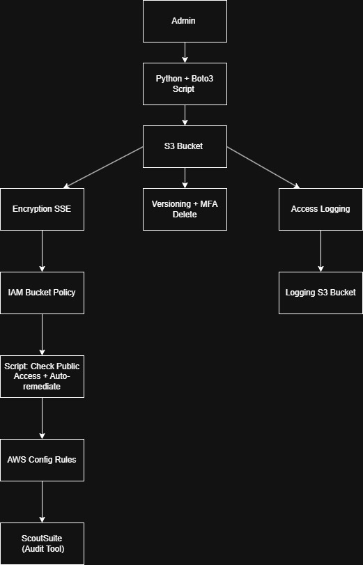

# s3-security-automation

This project demonstrates the development of a secure, compliant, and automated Amazon S3 environment. It reflects real-world security practices and automation strategies aligned with industry standards.

## Project Overview

The goal of this project is to implement a comprehensive S3 storage configuration with a focus on:

- Automation of secure S3 bucket creation using Python (Boto3)
- Application of encryption (SSE-S3 and/or SSE-KMS)
- Implementation of least-privilege IAM bucket policies
- Public access detection and auto-remediation
- Integration of access logging, versioning, and MFA Delete
- Configuration compliance validation using AWS Config
- Cloud environment auditing using ScoutSuite

This project is structured and documented to simulate how a Cloud Security Analyst or Engineer would deliver secure storage provisioning, monitoring, and remediation in a real-world AWS environment.

## Key Components

| Area                     | Implementation                                             |
|--------------------------|------------------------------------------------------------|
| Infrastructure Automation| Python scripts using Boto3                                 |
| Encryption at Rest       | SSE-S3 and optional SSE-KMS                                |
| Access Management        | IAM bucket policies with least privilege                   |
| Data Upload              | Programmatic upload of image files                         |
| Logging and Recovery     | Access logging, versioning, and MFA Delete                 |
| Compliance Auditing      | AWS Config rules for continuous monitoring                 |
| Misconfiguration Handling| Scripts for public access detection and remediation        |
| Cloud Security Audit     | ScoutSuite scan with observations and screenshots          |

## Topics Covered

- AWS S3 Security Configuration
- IAM (Least Privilege Access Policies)
- Python + Boto3 Automation
- AWS CLI for S3 Operations
- SSE-S3 and SSE-KMS Encryption
- Access Logging, Versioning, and MFA Delete
- Public Access Detection & Auto-Remediation
- AWS Config Compliance Monitoring
- ScoutSuite Cloud Security Auditing

## Repository Structure

```python
s3-security-automation/
│
├── 01_s3_architecture/ # AWS architecture diagram
├── 02_scripts/ # Python and CLI-based automation scripts
├── 03_screenshots/ # Step-by-step setup verification (blurred/redacted where required)
├── 04_s3_scoutsuite_report/ # ScoutSuite report snapshots
├── README.md # Project documentation
```
## Tools and Technologies

- AWS (S3, IAM, Config)
- Python (Boto3)
- AWS CLI
- ScoutSuite
- Visual Studio Code
- Git & GitHub for version control

## Architecture Summary

The architecture diagram outlines the secure layering of S3 buckets, including a logging bucket and configuration validation pipeline. It highlights encryption, access control, and compliance elements.



## Screenshots

Detailed visual documentation of each stage of implementation is available under the `03_screenshots/` directory. This includes:

- Code execution outputs
- AWS Console validation
- Access policy configurations
- Compliance rule evaluations
- Audit summaries (ScoutSuite)

All sensitive identifiers and metadata have been redacted or blurred to maintain security standards.

## Author

Noufa Sunkesula 

Mail ID: noufasunkesula@gmail.com

Contact: +91 8106859686
